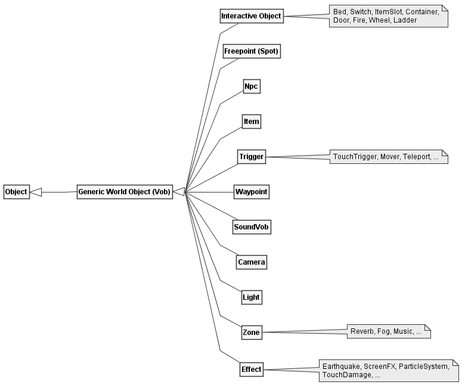

# Overview

- [Overview](#overview)
- [Objects of the World](#objects-of-the-world)
- [What is a ...](#what-is-a)
  - [Vob (Virtual Object)](#vob-virtual-object)
  - [Interactive Object (Mob)](#interactive-object-mob)
  - [Freepoint (Spot)](#freepoint-spot)
  - [NPC](#npc)
  - [Item](#item)
    - [Script Dependency during World Load](#script-dependency-during-world-load)
- [Rain](#rain)
    - [When does it rain?](#when-does-it-rain)
- [Action-Queue](#action-queue)
  - [Example](#example)
  - [Filling the Queue via Scripting](#filling-the-queue-via-scripting)
  - [Overlay Events](#overlay-events)
- [Daily Routines](#daily-routines)
  - [Waypoints as rough location markers](#waypoints-as-rough-location-markers)
  - [Script States](#script-states)
  - [Interruptions](#interruptions)
  - [Weird Daily Routines](#weird-daily-routines)
- [Dialogue-System](#dialogue-system)
  - [Example - Drug Monopol](#example---drug-monopol)
  - [Tracking active Quests](#tracking-active-quests)

In this Document, I am going to discuss the architecture of the games
_Gothic I & II_ by _Piranha Bytes_. Both games are built upon the
_zEngine_ or _ZenGin_, originally developed by a group of students
called _Mad Scientists_. If you want to know more about the development
of Gothic, I recommend the excellent series [Gothic in a
Nutshell](https://www.youtube.com/watch?v=yuvISO5qGG8) by arhn.eu.

These texts are not meant to be a strict reference, but rather a peek
into the engines architecture and functionality for those interested to
learn more about the inner workings of the Gothic games on a higher
level.

# Objects of the World

The zEngine heavily relies on [Object Oriented
Programming](https://en.wikipedia.org/wiki/Object-oriented_programming%3E):
For most of the objects you can see in the game world there is usually
one Class representing it. Object specific features are added using
inheritance.



**_Fig. 1:_** Simplified world object class hierarchy of the zEngine.
Specialized subclasses are shown in notes.

As shown in **_Fig. 1_**, there aren't actually that many different
world objects. Here are some observations:

- Most classes inherit from the generic `Object` class, even those
  which are not placed into the world (not shown here).
- A class needs to inherit from the `Vob` class (Virtual Object) if
  its instances are supposed to be placed into the world.
- The class hierarchy does not make a difference between a Monster or
  a Human.
- Even though it is not an NPC, the player's character is also using
  the `Npc` class.

There are a couple more relevant classes for Visuals and AI, but as
those are not actual world objects, these have been omitted from the
diagram.

> Actual names of zEngine classes use two different prefixes. For
> example, there exists a `zCVob` and an `oCVob`. The `zC`-prefix means
> that this is a non-gothic specific class. All `oC`-prefixed classes
> were made specifically for gothic.
>
> This is likely because the engine was meant to be used in other games
> as well, that just never happened.

# What is a ...

In this chapter, I'd like to give a quick overview over all the
different classes shown in **_Fig. 1_**.

## Vob (Virtual Object)

Whenever an object goes into the world, it is based on the `Vob` class.
The `Vob` class adds the following important properties to an object:

- Transform (Position and Rotation, no Scale)
- Visual (Mesh, Particle System, Animated Mesh)
- Frame Updates
- Physics
- AI
- Event-Queue

Not all of these features are used on every object. They are only
initialized when required. For example, most decorative objects use a
Mesh visual and physics for collision, but no AI.

## Interactive Object (Mob)

As far as I'm aware, nobody knows why objects characters can interact
with are called _Mobs_ or _Mobsies_. I have been told not even actual
Piranha Bytes employees know! Anyways, **_Fig. 2_** shows a complete
list of all interactive objects in Gothic.


**_Fig. 2:_** Subclasses of the _Interactive Object_ class (`Mob`).

Mobs are built upon the same animation state machine system as used by
NPCs. Rather than having states named `Running Forward` and transitions
like `Standing -> Running Forward`, they often use a simpler numbering
scheme. Lets look at the Chest in **_Fig. 3_** to give an example.


**_Fig. 3:_** The two states of a Chest, Closed **(a)** and Open
**(b)**.

For the chest, the following animations are defined:

- `S_S0` (Closed)
- `S_S1` (Open)
- `T_S0_2_S1` (Transition _Closed_ to _Open_)
- `T_S1_2_S0` (Transition _Open_ to _Closed_)
- `T_S0_TRY` (No key, lid is wiggling)

This produces the statemachine shown in **_Fig. 4_**.


**_Fig. 4:_** All possible states a Chest can have.

The trick that makes this all work is _that the Characters have a
similar set of animations!_ There is one for each state and each
transition, for every Mob even! If the Mob goes into a state, the
Character follows. Such an animation is shown in **_Fig. 5_**, which is
where the Character kicks the chest because it does not open, which
causes its lid to wiggle.


**_Fig. 5:_** Animation named `T_CHESTBIG_S0_TRY`, matching the wiggling
lid of the chest.

> This state-scheme is why in Gothic 1 you have to specifically press
> the _Forward_-Button to open Chests or use Mobs in general. Pressing
> _Forward_ and _Backward_ cycles through the state numbers! It is also
> possible to branch to different sub-states using the _Left_ and
> _Right_ keys, but that is rarely used.
>
> Gothic 2 automates this process for some Mobs.

## Freepoint (Spot)

Spots (also known as Freepoints) are invisible objects scattered through
the world. They are only needed for their location and name and could be
compared to a [Plain Axes
Empty](https://docs.blender.org/manual/en/latest/modeling/empties.html)
from Blender.

Often, Spots are scattered around fireplaces or monster locations. A
Spot can then be used by characters or monsters for certain actions. For
example, they tell the Npcs where they can sit. If a spot is occupied,
the Npc will simply choose the next available spot. If that is also
occupied it will usually just stand somewhere, trying to do smalltalk.

For Monsters, Spots define where they can go when they want to go for a
little walk around they spawning location (Roaming).

All of that is realized by giving each Spot a special name, ie. `FP_SIT`
or `FP_ROAM`. There can be many Spots with the same name, but the game
just checks whether the tag is _somewhere_ in the name. The process goes
like this:

1.  _Is there any place where I can sit down at?_
2.  \*Searches for nearby unoccupied `FP_SIT` spots\*
3.  _Ah, there by the campfire is a nice spot! I'll occupy that for a
    moment!_

## NPC

The Npc class is used for **Humans** and **Monsters**. There is no
difference, no subclass, it is all handled using some if-else-magic,
visuals and the animation statemachine. Even the Player is an NPC! That
makes no sense and that is why in REGoth, for example, I chose to name
them _Characters_.

The inner workings of NPCs are a huge topic for itself. But I'm going to
give a broad overview:

- **Visual:** Whether the Character is a Monster, a Human or an Orc is
  determined using the Visual, which is always a Skeletal-Mesh.

- **Event-Queue:** Most of the times when an NPC is told to do
  something via scripting, that action is pushed the characters
  _Event-Queue_. That queue then contains actions like _Walk to some
  location_, _Pick up that item_, _Attach the player_, which are all
  played back in order. The next action is started, when the action in
  front of the queue is completed.

  That queue can be interrupted and cleared by certain actions, such
  as catching fire.

- **AI:** While actions are usually executed by the _Event-Queue_,
  something needs to fill that queue. This can be done from the games
  scripts or by the AI, which includes handling fighting and other Npc
  tasks.

- **Inventory:** Each Character has an inventory to store items in. If
  you played Gothic, you will have noticed that merchants have two
  different inventories: One for selling stuff and one if you knock
  them over and want to loot them.

  Both of these are handled using a single inventory. If a merchant
  gets knocked out, their shop-inventory gets replaced by their
  loot-inventory by scripts. There is actually a bug in which that
  swap was forgotten on the Seekers if they died from an Iceblock
  spell, which allowed you to loot their spells and armor.

- **Information-Knowledge:** Every Character has a Database of which
  dialog options the player has told to them. From the script, that
  database can be queried to see whether an Npc has knowledge about
  something.

- **Daily Routine:** If the Event-Queue is empty, the characters daily
  routine is started. The daily routine specifies where the Npc should
  be on certain times over the day.

  An example would be:

  - From _06:00_ to _12:00_: Sit at Campfire near the entrance of
    the Old Camp.
  - From _12:00_ to _22:00_: Make swords at the forge.
  - From _22:00_ to _06:00_: Sleep in the bed closest to your
    starting location.

  The daily routine makes heavy use of Mobs and Spots to get the Npc
  through the day. Routines usually spawn sub-routines, also known as
  "States", which define the order in which the Npc should use the
  tools in the forge to make a weapon.

  Monsters do not have a Daily Routine. They are controlled by a
  simpler scheduling mechanism: Sleep, Eat, Roam, Repeat.
  Additionally, they can flee from predators (e.g. Scavengers flee
  from Snappers if attacked).

## Item

Everything you can pick up from the ground is using the `Item` class. They have
the following important properties:

- Display name
- Item category (Potion, weapon, ...)
- Value in Gold/Ore
- Description Text

Then, they _all_ have properties regarding consumables, armor, weapons, and so
on, which are just disabled by default. That could be:

- Script function to run on use, equip and unequip
- New Visual for the character who equipped this (for armors)
- Magic cycle and script functions
- Guild and fake-Guild
- Spell range
- For a full list, see [this](https://github.com/GothicII/GOTHIC-MOD-Development-Kit/blob/4071a70b3a8943e374ccbf886986e494b4be0858/gothic/_work/data/Scripts/content/_Intern/CLASSES.D#L79).

Depending on the item category, some of these are used while the others are
ignored. I imagine this could have been made nicer be creating more classes, and
not shoving everything into one base class...

### Script Dependency during World Load

Items can be spawned via script, but usually are loaded straight from the
world-file (`.zen`). However, the visual of the item is always defined in the
script instance!

For example, let's take a look at the [Health Potion instance
definition](https://github.com/GothicII/GOTHIC-MOD-Development-Kit/blob/4071a70b3a8943e374ccbf886986e494b4be0858/gothic/_work/data/Scripts/content/Items/Potions.d#L164)
(see `Mesh to use` comment):

```c
INSTANCE ItFo_Potion_Health_01(C_Item)
{
  name        = NAME_Trank;

  mainflag    = ITEM_KAT_POTIONS;
  flags       = ITEM_MULTI;

  value       = Value_HpEssenz;

  visual      = "ItFo_Potion_Health_01.3ds"; // <------------ Mesh to use
  material    = MAT_GLAS;
  on_state[0] = UseHealthPotion;
  scemeName   = "POTIONFAST";

  description = "Essenz heilender Kraft ";
  TEXT[1]     = NAME_Bonus_HP; COUNT[1] = HP_Essenz;
  TEXT[5]     = NAME_Value;    COUNT[5] = Value_HpEssenz;
};
```

In the world-file itself, only the instances name is stored, such as
`ItFo_Potion_Health_01` in the example above.

This requires you to have the Daedalus-VM ready while loading the world, if you
want to place all items on that step. Without being able to run instance
constructors you're not going to know how the items should look like.

> This is especially unfortunate, since the visual is the only missing piece at
> load time. You could delay running the script instance constructor until the
> item is picked up and write a full world importer without ever touching the
> scripts...
>
> If you are dealing with items from the original game only, you may precompute
> the mapping of script instances to visuals, but that would not work for mods
> with custom items.

# Rain

On the (almost) yearly _Moddertreffen_, a Community Meetup, I have been told,
that while the programmers thought Rain was important for an authentic feeling,
management (or the publisher, can't remember) didn't think so. The legend goes
that some members of the team met at the weekend and implemented rain into the
engine, because it felt like the right thing to do. Management liked it (or
didn't care) and they left it in.

### When does it rain?

The two main properties for controlling the rain are its _Start_ and _Stop_ times.

- There are no limitations on when the rain happens during the day (or night).
- The minimum duration for rain is 1 hour.
- The maximum duration is about 2.5 hours.

The following special cases exist:

1.  The first rain-event always happens between 16:30 and 17:30, so that the
    player will definitely see it.
2.  On the first 3 Days, it only rains. After those, there is also lightning with a chance of 40%.

# Action-Queue

While in Gothic, every Vob can have an Action-Queue, they are most used by Npcs.
Actually, the Action-Queue is _the_ inner core of Npc behavior!

The Action-Queue itself is best described as a First-In-First-Out buffer with
extra steps. It holds actions of the following categories:

- Damage
- Weapon
- Movement (Go somewhere)
- Attack (Single attacks)
- UseItem
- Script State
- Manipulate (Items/Mobs)
- Conversation
- Magic

> For a full list of categories and sub-types, basically everything an Npc can
> do in Gothic, see [this document](EventMessages.md).

On every frame, the action at the front of the queue is executed. The action
itself can decide whether it is done after it was executed, or if it needs to be
executed again next frame:

- If the action says it is **done**, it will be popped from the queue and the
  **next action will be executed** next frame.
- If the action is **_not_ done** yet, it will stay at the front of the queue
  and **will be executed again** next frame.

## Example

Let's assume the following sequence of actions has been pushed into an Npcs Action-Queue:

| **Index**  |       0       |     1     |        2        |            3            |         4          |
| :--------: | :-----------: | :-------: | :-------------: | :---------------------: | :----------------: |
| **Action** | Goto Location | Take Item | Use Item (Beer) | Goto Character (Player) | Give Item (5x Ore) |

The Action at index 0 (_Goto Location_) is at the front of the queue and thus
will be executed for as long as the Npc is not at the target location.

On every frame, when the _Goto Location_ action is executed, it will check
whether the Npc arrived at its destination. Lets say, it did. Then, the action
will be popped off the Queue and the next one takes its place. The Queue now
looks like this:

| **Index**  |     0     |        1        |            2            |         3          |
| :--------: | :-------: | :-------------: | :---------------------: | :----------------: |
| **Action** | Take Item | Use Item (Beer) | Goto Character (Player) | Give Item (5x Ore) |

The next Action is now at the front of the queue and will be executed. For _Take
Item_, it will block the queue until all animations have been finished and the
item is in the inventory (if the Npc could pick it up, that is). After the item
was picked up, the Action signals that it is done. The queue now looks like
this:

| **Index**  |        0        |            1            |         2          |
| :--------: | :-------------: | :---------------------: | :----------------: |
| **Action** | Use Item (Beer) | Goto Character (Player) | Give Item (5x Ore) |

And so on, you get the Idea.

## Filling the Queue via Scripting

The Action-Queue is the most important system to let the games scripts work in
the way they do. Many of the Npc related script external functions actually just
push an action into the queue and continue with executing the script.

Most commonly used in dialogues, the `AI_Output` external lets a character say something. In the original scripts, a dialogue [can look like this](https://github.com/GothicII/GOTHIC-MOD-Development-Kit/blob/4071a70b3a8943e374ccbf886986e494b4be0858/gothic/_work/data/Scripts/content/Story/MISSIONS/DIA_Pc_Thief.d#L28):

```c
FUNC void  PC_Thief_WHEEL_Info()
{
  AI_Output(self, hero,"PC_Thief_WHEEL_Info_11_01"); //Die Winde scheint zu klemmen.
  AI_Output(self, hero,"PC_Thief_WHEEL_Info_11_02"); //Lass mich mal, vielleicht kann ich da was machen!

  AI_StopProcessInfos(self); // Cancels dialogue

  AI_GotoWP(self,"LOCATION_12_14_WHEEL");
  AI_AlignToWP(self);

  AI_PlayAni(self,"T_PLUNDER");
};
```

In this dialogue option, Diego tells the Hero "Let me try" and goes to the
broken wind to turn it. All those `AI_`-functions push an action into Diegos
Action-Queue and are executed sequentially, one after another.

## Overlay Events

Usually, only the event at the front of the queue is active and passed to
the target object. However, events marked as "Overlay" will act a little
bit different.

If such an overlay-event is at the front of the queue, it will be passed
to the target object every update cycle. Then, the next event in the queue
is looked at. If that is also an overlay-event, it is passed to the object as
well.

This continues until the first event is encountered which is not an
overlay. That will be the last event passed to the object.

# Daily Routines

As discussed in the [NPC class overview](#npc), the Daily Routine is executed if
an NPC has nothing else to do. They are defined via Daedalus-scripts. For
example, this is [Diegos Daily
Routine](https://github.com/GothicII/GOTHIC-MOD-Development-Kit/blob/4071a70b3a8943e374ccbf886986e494b4be0858/gothic/_work/data/Scripts/content/Story/NPC/PC_Thief.d#L50)
after you talked to him at the start of the game (`TA` meaning `Tages Ablauf`,
just `Daily Routine` in German):

```c
FUNC VOID Rtn_Start_1 ()
{
  //              Start   End
  TA_Sleep       (23,00,  03,00,  "OCR_HUT_1");
  TA_SitAround   (03,00,  05,30,  "OCR_HUT_Z5_SIT3");
  TA_Sleep       (05,30,  07,00,  "OCR_CAULDRON_1");
  TA_SitAround   (07,00,  10,00,  "OCR_CAULDRON_1");
  TA_Smalltalk   (10,00,  12,00,  "OCR_CAMPFIRE_A_MOVEMENT1"); //mit Grim
  TA_SitAround   (12,00,  16,00,  "OCR_CAULDRON_1");
  TA_Smalltalk   (16,00,  18,00,  "OCR_CAMPFIRE_A_MOVEMENT3"); //mit Stt_322
  TA_SitCampfire (18,00,  23,00,  "OCR_CAMPFIRE_A_MOVEMENT1");
};
```

Script functions like the one above are executed once when the NPC is spawned or
has changed its Daily Routine. Each of the function calls registers its activity
in the Todo-list each Npc has for the specified timespan and Waypoint, which
specifies the location on where that activity should be done.

> Internally, each of those `TA_something`-functions maps to only one script
> external, `TA_Min`. A complete list of all possible actions is defined
> [here](github.com/GothicII/GOTHIC-MOD-Development-Kit/blob/4071a70b3a8943e374ccbf886986e494b4be0858/gothic/_work/data/Scripts/content/Story/ZS/Ta.d).

## Waypoints as rough location markers

As you can see in the code snipped above, there is an interesting comment, `// mit Grim`:

```c
TA_Smalltalk(..., "OCR_CAMPFIRE_A_MOVEMENT1") // mit Grim
```

This says, that Diego should to Smalltalk with the Npc _Grim_. However, that is
just a code comment. The `TA_Smalltalk` activity just searches for _any_ nearby
Npc to do smalltalk with. In Grims Daily Routine, there is a similar entry,
which makes them both go to the same location to meet there every day. Both of
them just don't know who to expect there and meet every day by "chance", which
is kinda funny.

This also applies to states where interactive items are involved. They usually
just say _Go to some location and see if you can find an Amboss to work on_. If
that is already occupied, the Npc may do something else instead.

## Script States

This is a complex topic, which I need to quickly go over for daily routines.
However, Script States are also used for other purposes extensively.

Each of the Daily-Routine actions registered for that Npc executes a _Script
State_ on that Npc when its time has come. For example, lets look at this line
again:

```c
  TA_Smalltalk   (10,00,  12,00,  "OCR_CAMPFIRE_A_MOVEMENT1"); //mit Grim
```

On execution, this registers the Script State `ZS_SMALLTALK` from 10:00 to 12:00
at the location `OCR_CAMPFIRE_A_MOVEMENT1` in Diegos Daily Routine.
`ZS_SMALLTALK` is then defined
[here](https://github.com/GothicII/GOTHIC-MOD-Development-Kit/blob/4071a70b3a8943e374ccbf886986e494b4be0858/gothic/_work/data/Scripts/content/Story/ZS/ZS_Smalltalk.d).

Each Script State can have the following script functionality:

1. An `init` function, called once when the state is started
2. A `loop` function, called every frame while the state is active and there is
   nothing else to do. This function can also decide whether the state should
   continue.
3. An `end` function, called when the state has ended.

If the time goes on and a different Daily Routine action gets activated, the
current state is canceled gracefully and the next state is started.

> **_Example: Smalltalk_**
>
> For `ZS_SMALLTALK`, you can break that down in the following (as seen from the
> Npcs perspecitve):
>
> **Begin the state:**
>
> 1.  Set me to slow-walkmode.
> 2.  If I am not already on a Freepoint called `SMALLTALK`, let me go to the
>     Waypoint registered in the Daily Routine.
> 3.  Then, let me go to the next unoccupied Freepoint called `SMALLTALK`.
> 4.  Face into the direction of the Freepoint.
>
> **Then, when there is nothing else to do:**
>
> 
>
> On this particular Script-State, there is not action when the state ended.

## Interruptions

Execution of the Script State belonging to the current Daily Routine action is
interrupted by assigning any other Script State to the Npc, ie. when when taking
damage or talking to the Npc, which starts `ZS_TALK`.

Once the non-routine Script State is over and the Npc has nothing to do anymore,
the Daily Routine is started again.

## Weird Daily Routines

There are some gameplay elements you wouldn't think of as a Daily Routine, such as

- Following the Player
- Guiding the player to some location

# Dialogue-System

  
**_Fig. 6:_** Dialogue Options ([Source](https://www.mobygames.com/game/windows/gothic/screenshots/gameShotId,20018/))

In Gothics Dialogue-System, everything revolves around _Information_-Instances and their _Conditions_.

Every dialogue option you can see in **_Fig. 6_** is an _Information_-Instance, which has the following properties:

- **Description** The text the player sees in the dialogue menu
- **Priority** Top to Bottom ordering
- **Is Permanent?** Whether the line is always shown and can be used multiple times.
- **Is Important?** Whether the Npc should start talking to the player automatically to tell him this information. Guards usually do this to stop you.
- **Condition-Function** If this script function returns `True`, this information is shown in the dialogue menu. Evaluated every time the Dialogue Menu is loaded.
- **Info-Function** Script function to be called when this information got selected in the dialogue menu.

Every time the dialogue menu is loaded, the _Condition_ function is called to
check whether the dialogue line should be available in the menu.

Whenever you as the Player choses a dialogue line in the menu, the _Hero_
remembers that you chose that line. This is because only the originator of the
conversation stores the selected information-lines.

Dialogue-lines already known by the player and not flagged as `Permanent` will not show up in the menu anymore.

> If two Npcs would talk to each other, the one starting the conversation would
> also store information-lines they chose. However, since Gothic is a Single
> Player game, that never happens.

The scripts can then check whether the Hero knows a certain information [like so](https://github.com/GothicII/GOTHIC-MOD-Development-Kit/blob/4071a70b3a8943e374ccbf886986e494b4be0858/gothic/_work/data/Scripts/content/Story/MISSIONS/DIA_GUR_1201_CorKalom.d#L255):

```c
if (Npc_KnowsInfo(hero,DIA_BaalOrun_GotWeed)) // Equals to "Has the player ever chosen that dialogue line?"
{
  // ... do something
}
```

## Example - Drug Monopol

In this dialogue, the player gets asked by Cor Kalom to stop a Swampweed production of the New Camp. This is the [_Information_-Instance](https://github.com/GothicII/GOTHIC-MOD-Development-Kit/blob/4071a70b3a8943e374ccbf886986e494b4be0858/gothic/_work/data/Scripts/content/Story/MISSIONS/DIA_GUR_1201_CorKalom.d#L379):

```c
INSTANCE Info_Kalom_DrugMonopol (C_INFO)
{
  npc         = GUR_1201_CorKalom;
  condition   = Info_Kalom_DrugMonopol_Condition;
  information = Info_Kalom_DrugMonopol_Info;
  permanent   = 0;
  description = "Hast DU noch eine Aufgabe für mich?";
};
```

Here, the condition checks, whether the player is joined the Swamp Camp and is now a Novice:

```c
FUNC INT Info_Kalom_DrugMonopol_Condition()
{
  if (Npc_GetTrueGuild(other)==GIL_NOV)
  {
    return 1;
  }

  // implicit return 0
}
```

When the Player selected the dialogue line of this _Information_-Instance, this function gets called:

```c
FUNC VOID Info_Kalom_DrugMonopol_Info()
{
  AI_Output (other, self,"Mis_1_Psi_Kalom_DrugMonopol_15_00"); // ...
  AI_Output (self, other,"Mis_1_Psi_Kalom_DrugMonopol_10_01"); // ...

  // ... <snip>
}
```

Once the Player has selected the dialogue line, the Hero remembers it. Other scripts can then check whether that dialogue line was ever chosen by the player via a call to `Npc_KnowsInfo`.

Dialogue-lines already known by the player and not flagged as `Permanent` will not show up in the menu anymore.

## Tracking active Quests

Tracking active quests is handled a bit weird by Gothic. Scripts have write-access to the players Quest-Log, but they cannot read back the quest status.
Thus, a global booleab variable was created for most quests to track whether its active. Additionally, the Quest-Log is [kept in sync](https://github.com/GothicII/GOTHIC-MOD-Development-Kit/blob/4071a70b3a8943e374ccbf886986e494b4be0858/gothic/_work/data/Scripts/content/Story/MISSIONS/DIA_Bau_935_Homer.d#L110):

```c
Homer_DamLurker = LOG_RUNNING; // Global variable

Log_CreateTopic   (CH1_DamLurker, LOG_MISSION);
Log_SetTopicStatus(CH1_DamLurker, LOG_RUNNING);
```

I can't think of a reason other than the Quest-Log being implemented much later into development for this to make sense.
