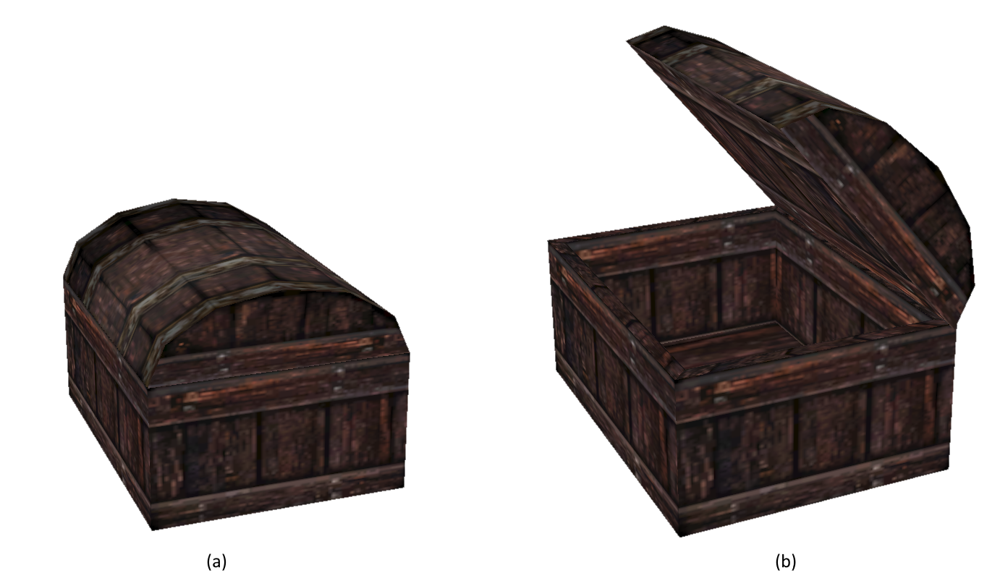
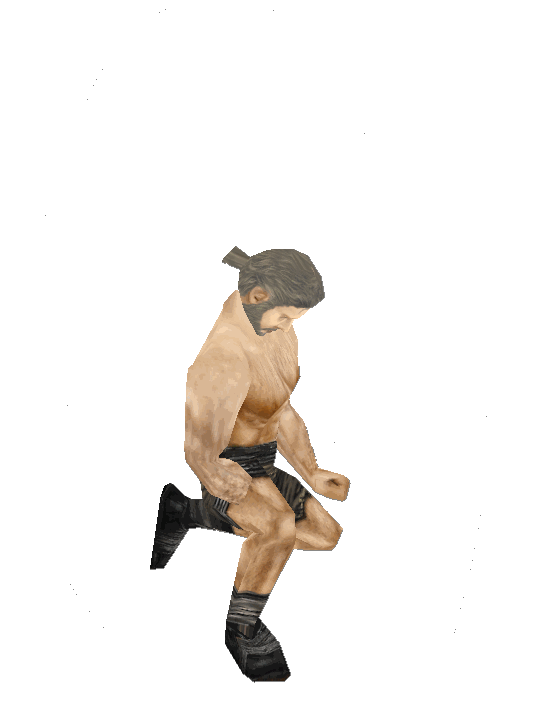

# Overview

In this Document, I am going to discuss the architecture of the games
_Gothic I & II_ by _Piranha Bytes_. Both games are built upon the
_zEngine_ or _ZenGin_, originally developed by a group of students
called _Mad Scientists_. If you want to know more about the development
of Gothic, I recommend the excellent series [Gothic in a
Nutshell](https://www.youtube.com/watch?v=yuvISO5qGG8) by arhn.eu.

These texts are not meant to be a strict reference, but rather a peek
into the engines architecture and functionality for those interested to
learn more about the inner workings of the Gothic games on a higher
level.

# Objects of the World

The zEngine heavily relies on [Object Oriented
Programming](https://en.wikipedia.org/wiki/Object-oriented_programming%3E):
For most of the objects you can see in the game world there is usually
one Class representing it. Object specific features are added using
inheritance.

**_Fig. 1:_** Simplified world object class hierarchy of the zEngine.
Specialized subclasses are shown in notes.

As shown in **_Fig. 1_**, there aren't actually that many different
world objects. Here are some observations:

- Most classes inherit from the generic `Object` class, even those
  which are not placed into the world (not shown here).
- A class needs to inherit from the `Vob` class (Virtual Object) if
  its instances are supposed to be placed into the world.
- The class hierarchy does not make a difference between a Monster or
  a Human.
- Even though it is not an NPC, the player's character is also using
  the `Npc` class.

There are a couple more relevant classes for Visuals and AI, but as
those are not actual world objects, these have been omitted from the
diagram.

> Actual names of zEngine classes use two different prefixes. For
> example, there exists a `zCVob` and an `oCVob`. The `zC`-prefix means
> that this is a non-gothic specific class. All `oC`-prefixed classes
> were made specifically for gothic.
>
> This is likely because the engine was meant to be used in other games
> as well, that just never happened.

# What is a ...

In this chapter, I'd like to give a quick overview over all the
different classes shown in **_Fig. 1_**.

## Vob (Virtual Object)

Whenever an object goes into the world, it is based on the `Vob` class.
The `Vob` class adds the following important properties to an object:

- Transform (Position and Rotation, no Scale)
- Visual (Mesh, Particle System, Animated Mesh)
- Frame Updates
- Physics
- AI
- Event-Queue

Not all of these features are used on every object. They are only
initialized when required. For example, most decorative objects use a
Mesh visual and physics for collision, but no AI.

## Interactive Object (Mob)

As far as I'm aware, nobody knows why objects characters can interact
with are called _Mobs_ or _Mobsies_. I have been told not even actual
Piranha Bytes employees know! Anyways, **_Fig. 2_** shows a complete
list of all interactive objects in Gothic.

**_Fig. 2:_** Subclasses of the _Interactive Object_ class (`Mob`).

Mobs are built upon the same animation state machine system as used by
NPCs. Rather than having states named `Running Forward` and transitions
like `Standing -> Running Forward`, they often use a simpler numbering
scheme. Lets look at the Chest in **_Fig. 3_** to give an example.

**_Fig. 3:_** The two states of a Chest, Open **(a)** and Closed
**(b)**.

For the chest, the following animations are defined:

- `S_S0` (Closed)
- `S_S1` (Open)
- `T_S0_2_S1` (Transition _Closed_ to _Open_)
- `T_S1_2_S0` (Transition _Open_ to _Closed_)
- `T_S0_TRY` (No key, lid is wiggling)

This produces the statemachine shown in **_Fig. 4_**.

**_Fig. 4:_** All possible states a Chest can have.

The trick that makes this all work is _that the Characters have a
similar set of animations!_ There is one for each state and each
transition, for every Mob even! If the Mob goes into a state, the
Character follows. Such an animation is shown in **_Fig. 5_**, which is
where the Character kicks the chest because it does not open, which
causes its lid to wiggle.

**_Fig. 5:_** Animation named `T_CHESTBIG_S0_TRY`, matching the wiggling
lid of the chest.

> This state-scheme is why in Gothic 1 you have to specifically press
> the _Forward_-Button to open Chests or use Mobs in general. Pressing
> _Forward_ and _Backward_ cycles through the state numbers! It is also
> possible to branch to different sub-states using the _Left_ and
> _Right_ keys, but that is rarely used.
>
> Gothic 2 automates this process for some Mobs.

## Freepoint (Spot)

Spots (also known as Freepoints) are invisible objects scattered through
the world. They are only needed for their location and name and could be
compared to a [Plain Axes
Empty](https://docs.blender.org/manual/en/latest/modeling/empties.html)
from Blender.

Often, Spots are scattered around fireplaces or monster locations. A
Spot can then be used by characters or monsters for certain actions. For
example, they tell the Npcs where they can sit. If a spot is occupied,
the Npc will simply choose the next available spot. If that is also
occupied it will usually just stand somewhere, trying to do smalltalk.

For Monsters, Spots define where they can go when they want to go for a
little walk around they spawning location (Roaming).

All of that is realized by giving each Spot a special name, ie. `FP_SIT`
or `FP_ROAM`. There can be many Spots with the same name, but the game
just checks whether the tag is _somewhere_ in the name. The process goes
like this:

1.  _Is there any place where I can sit down at?_
2.  \*Searches for nearby unoccupied `FP_SIT` spots\*
3.  _Ah, there by the campfire is a nice spot! I'll occupy that for a
    moment!_

## NPC

The Npc class is used for **Humans** and **Monsters**. There is no
difference, no subclass, it is all handled using some if-else-magic,
visuals and the animation statemachine. Even the Player is an NPC! That
makes no sense and that is why in REGoth, for example, I chose to name
them _Characters_.

The inner workings of NPCs are a huge topic for itself. But I'm going to
give a broad overview:

- **Visual:** Whether the Character is a Monster, a Human or an Orc is
  determined using the Visual, which is always a Skeletal-Mesh.

- **Event-Queue:** Most of the times when an NPC is told to do
  something via scripting, that action is pushed the characters
  _Event-Queue_. That queue then contains actions like _Walk to some
  location_, _Pick up that item_, _Attach the player_, which are all
  played back in order. The next action is started, when the action in
  front of the queue is completed.

  That queue can be interrupted and cleared by certain actions, such
  as catching fire.

- **AI:** While actions are usually executed by the _Event-Queue_,
  something needs to fill that queue. This can be done from the games
  scripts or by the AI, which includes handling fighting and other Npc
  tasks.

- **Inventory:** Each Character has an inventory to store items in. If
  you played Gothic, you will have noticed that merchants have two
  different inventories: One for selling stuff and one if you knock
  them over and want to loot them.

  Both of these are handled using a single inventory. If a merchant
  gets knocked out, their shop-inventory gets replaced by their
  loot-inventory by scripts. There is actually a bug in which that
  swap was forgotten on the Seekers if they died from an Iceblock
  spell, which allowed you to loot their spells and armor.

- **Information-Knowledge:** Every Character has a Database of which
  dialog options the player has told to them. From the script, that
  database can be queried to see whether an Npc has knowledge about
  something.

- **Daily Routine:** If the Event-Queue is empty, the characters daily
  routine is started. The daily routine specifies where the Npc should
  be on certain times over the day.

  An example would be:

  - From _06:00_ to _12:00_: Sit at Campfire near the entrance of
    the Old Camp.
  - From _12:00_ to _22:00_: Make swords at the forge.
  - From _22:00_ to _06:00_: Sleep in the bed closest to your
    starting location.

  The daily routine makes heavy use of Mobs and Spots to get the Npc
  through the day. Routines usually spawn sub-routines, also known as
  "States", which define the order in which the Npc should use the
  tools in the forge to make a weapon.

  Monsters do not have a Daily Routine. They are controlled by a
  simpler scheduling mechanism: Sleep, Eat, Roam, Repeat.
  Additionally, they can flee from predators (e.g. Scavengers flee
  from Snappers if attacked).
