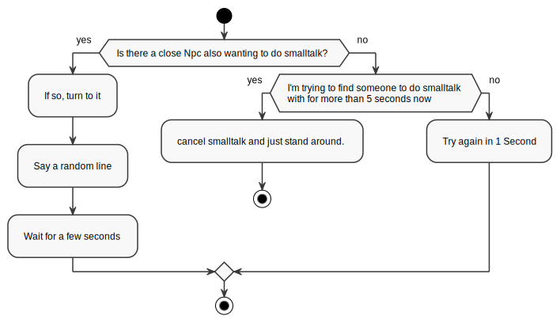

# Daily Routines

As discussed in the [NPC class overview](#npc), the Daily Routine is executed if
an NPC has nothing else to do. They are defined via Daedalus-scripts. For
example, this is [Diegos Daily
Routine](https://github.com/GothicII/GOTHIC-MOD-Development-Kit/blob/4071a70b3a8943e374ccbf886986e494b4be0858/gothic/_work/data/Scripts/content/Story/NPC/PC_Thief.d#L50)
after you talked to him at the start of the game (`TA` meaning `Tages Ablauf`,
just `Daily Routine` in German):

```c
FUNC VOID Rtn_Start_1 ()
{
  //              Start   End
  TA_Sleep       (23,00,  03,00,  "OCR_HUT_1");
  TA_SitAround   (03,00,  05,30,  "OCR_HUT_Z5_SIT3");
  TA_Sleep       (05,30,  07,00,  "OCR_CAULDRON_1");
  TA_SitAround   (07,00,  10,00,  "OCR_CAULDRON_1");
  TA_Smalltalk   (10,00,  12,00,  "OCR_CAMPFIRE_A_MOVEMENT1"); //mit Grim
  TA_SitAround   (12,00,  16,00,  "OCR_CAULDRON_1");
  TA_Smalltalk   (16,00,  18,00,  "OCR_CAMPFIRE_A_MOVEMENT3"); //mit Stt_322
  TA_SitCampfire (18,00,  23,00,  "OCR_CAMPFIRE_A_MOVEMENT1");
};
```

Script functions like the one above are executed once when the NPC is spawned or
has changed its Daily Routine. Each of the function calls registers its activity
in the Todo-list each Npc has for the specified timespan and Waypoint, which
specifies the location on where that activity should be done.

> Internally, each of those `TA_something`-functions maps to only one script
> external, `TA_Min`. A complete list of all possible actions is defined
> [here](github.com/GothicII/GOTHIC-MOD-Development-Kit/blob/4071a70b3a8943e374ccbf886986e494b4be0858/gothic/_work/data/Scripts/content/Story/ZS/Ta.d).

## Waypoints as rough location markers

As you can see in the code snipped above, there is an interesting comment, `// mit Grim`:

```c
TA_Smalltalk(..., "OCR_CAMPFIRE_A_MOVEMENT1") // mit Grim
```

This says, that Diego should to Smalltalk with the Npc _Grim_. However, that is
just a code comment. The `TA_Smalltalk` activity just searches for _any_ nearby
Npc to do smalltalk with. In Grims Daily Routine, there is a similar entry,
which makes them both go to the same location to meet there every day. Both of
them just don't know who to expect there and meet every day by "chance", which
is kinda funny.

This also applies to states where interactive items are involved. They usually
just say _Go to some location and see if you can find an Amboss to work on_. If
that is already occupied, the Npc may do something else instead.

## Script States

This is a complex topic, which I need to quickly go over for daily routines.
However, Script States are also used for other purposes extensively.

Each of the Daily-Routine actions registered for that Npc executes a _Script
State_ on that Npc when its time has come. For example, lets look at this line
again:

```c
  TA_Smalltalk   (10,00,  12,00,  "OCR_CAMPFIRE_A_MOVEMENT1"); //mit Grim
```

On execution, this registers the Script State `ZS_SMALLTALK` from 10:00 to 12:00
at the location `OCR_CAMPFIRE_A_MOVEMENT1` in Diegos Daily Routine.
`ZS_SMALLTALK` is then defined
[here](https://github.com/GothicII/GOTHIC-MOD-Development-Kit/blob/4071a70b3a8943e374ccbf886986e494b4be0858/gothic/_work/data/Scripts/content/Story/ZS/ZS_Smalltalk.d).

Each Script State can have the following script functionality:

1. An `init` function, called once when the state is started
2. A `loop` function, called every frame while the state is active and there is
   nothing else to do. This function can also decide whether the state should
   continue.
3. An `end` function, called when the state has ended.

If the time goes on and a different Daily Routine action gets activated, the
current state is canceled gracefully and the next state is started.

!!! example

    For `ZS_SMALLTALK`, you can break that down in the following (as seen from the
    Npcs perspecitve):

    **Begin the state:**

    1.  Set me to slow-walkmode.
    2.  If I am not already on a Freepoint called `SMALLTALK`, let me go to the
        Waypoint registered in the Daily Routine.
    3.  Then, let me go to the next unoccupied Freepoint called `SMALLTALK`.
    4.  Face into the direction of the Freepoint.

    **Then, when there is nothing else to do:**

    

    On this particular Script-State, there is not action when the state ended.

## Interruptions

Execution of the Script State belonging to the current Daily Routine action is
interrupted by assigning any other Script State to the Npc, ie. when when taking
damage or talking to the Npc, which starts `ZS_TALK`.

Once the non-routine Script State is over and the Npc has nothing to do anymore,
the Daily Routine is started again.

## Weird Daily Routines

There are some gameplay elements you wouldn't think of as a Daily Routine, such as

- Following the Player
- Guiding the player to some location
