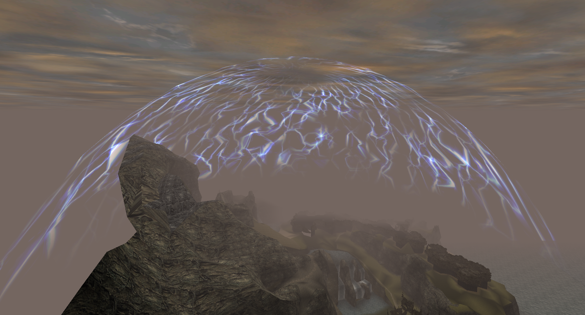

# Magic Barrier

The barrier (shown in _Fig. 1_) is one of the most atmosphere-enhancing features of Gothic I. It encloses the Valley of Mines and serves as a quite natural restriction of how far the player can go. In this chapter, we are looking at the technical details of how the Barrier works.

  
_**Fig. 1:** Barrier in Gothic 1 ([Source](https://gameffine.com/retro-sturdays-episode-22-gothic/))_

## How often does it appear?

As written [here](<https://forum.worldofplayers.de/forum/threads/396326-Tipp-Tageweise-springen-(auch-zurück)?p=6231841&viewfull=1#post6231841>), in Gothic,

- one in-game **day** is 1 hour and 40 minutes (6000 seconds) in the real world.
- one in-game **hour** is 250 seconds in the real world.

The barrier activates every 20 real-world minutes, with a variance of plus/minus 5 minutes. So,

- the barrier appears **3 times during in-game day**
- every **15 to 25 real-world minutes.**

## How long does it stay active?

Once the Barrier activates, it goes through three stages:

1.  Fade in for about 0.25 seconds
2.  Stay visible for 25 seconds
3.  Fade out for about 0.25 seconds

As you can see, the Barrier fades in and out rather quickly!

## Location

Interestingly, the Barrier does not move with the players camera, as often seen with Skyboxes. It always stays at a fixed location: centered over the Old Camp.

This makes it possible to see the Barrier from different perspectives, giving a sense of scale to the world. An outside-view of the Barrier is shown in _Fig. 2_.

  
_**Fig. 2:** Outside view of the Barrier, showing where it is located in the world._

## Thunder

While the Barrier is active, thunder-effects (shown in _Fig. 3_) can occur at each of the four [quadrants](<https://en.wikipedia.org/wiki/Quadrant_(plane_geometry)>) of the barrier.

  
_**Fig. 3:** Thunder effect on the barrier_

Each quadrant has a different rate in which it plays thunder effects:

| Quadrant | Activation Delay             | Landmarks in Quadrant    |
| -------: | :--------------------------- | ------------------------ |
|        1 | every 8 Seconds              | Orc-Town                 |
|        2 | every 6 Seconds              | Orc-Graveyard/Swamp Camp |
|        3 | every 14 Seconds             | Monastery ruin/Exchange  |
|        4 | every 2 Seconds (actually 4) | Old Mine                 |

Once a quadrants Activation Delay and the sound-effect of the previous thunder it played is over, it produces a new thunder-effect and restarts their timer.

!!! note

     The thunder sound-effect is roughly 4 seconds long. Quadrant 4's Activation Delay is shorter than that, so it will always end up waiting for the sound to end, making its Activation Delay equal to the length of the thunder sound.

     This was likely not intended.

!!! note

    The barriers quadrants are detected is slightly off-center, at position (-5008 cm, -10500 cm, -5597 cm).
    That however does not make any difference, since the mesh is _huge_.

    Still, this is the true thunder-center-point of the barrier (on the XZ plane):
    
