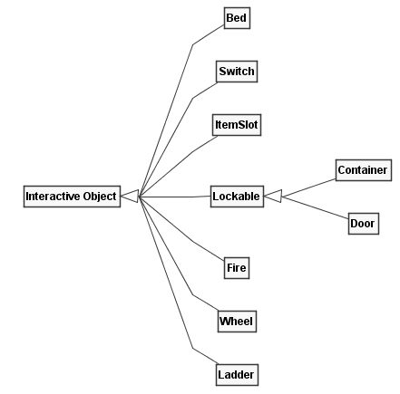
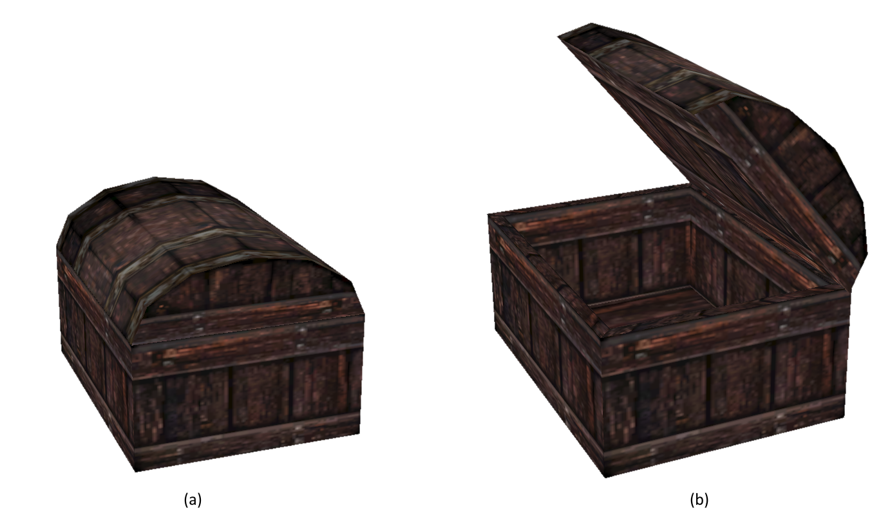
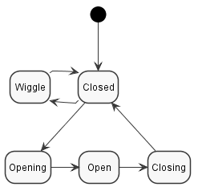
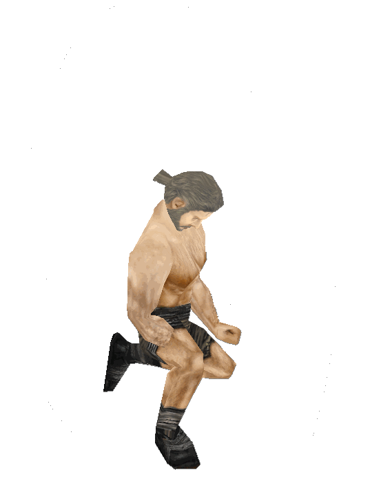

# Interactive Object (Mob)

As far as I'm aware, nobody knows why objects characters can interact
with are called _Mobs_ or _Mobsies_. I have been told not even actual
Piranha Bytes employees know! Anyways, **_Fig. 1_** shows a complete
list of all interactive objects in Gothic.

  
_**Fig. 1:** Subclasses of the \_Interactive Object_ class (`Mob`).\_

Mobs are built upon the same animation state machine system as used by
NPCs. Rather than having states named `Running Forward` and transitions
like `Standing -> Running Forward`, they often use a simpler numbering
scheme. Lets look at the Chest in **_Fig. 2_** to give an example.

  
_**Fig. 2:** The two states of a Chest, Closed **(a)** and Open
**(b)**._

For the chest, the following animations are defined:

- `S_S0` (Closed)
- `S_S1` (Open)
- `T_S0_2_S1` (Transition _Closed_ to _Open_)
- `T_S1_2_S0` (Transition _Open_ to _Closed_)
- `T_S0_TRY` (No key, lid is wiggling)

This produces the statemachine shown in **_Fig. 3_**.

  
_**Fig. 3:** All possible states a Chest can have._

The trick that makes this all work is _that the Characters have a
similar set of animations!_ There is one for each state and each
transition, for every Mob even! If the Mob goes into a state, the
Character follows. Such an animation is shown in **_Fig. 4_**, which is
where the Character kicks the chest because it does not open, which
causes its lid to wiggle.

  
_**Fig. 4:** Animation named `T_CHESTBIG_S0_TRY`, matching the wiggling
lid of the chest._

!!! note

    This state-scheme is why in Gothic 1 you have to specifically press
    the _Forward_-Button to open Chests or use Mobs in general. Pressing
    _Forward_ and _Backward_ cycles through the state numbers! It is also
    possible to branch to different sub-states using the _Left_ and
    _Right_ keys, but that is rarely used.

    Gothic 2 automates this process for some Mobs.
