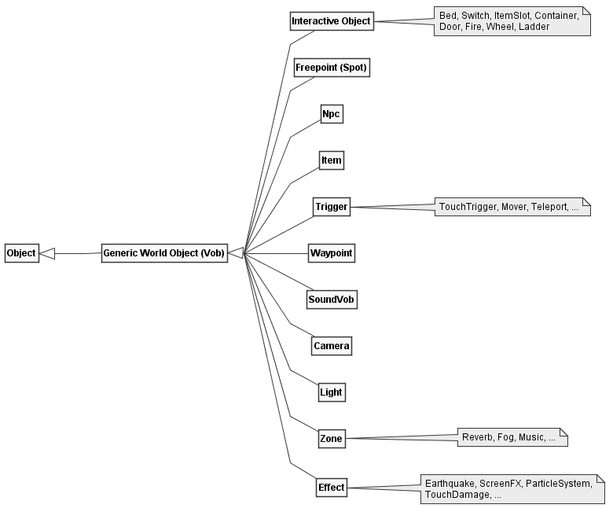

# Objects of the World

The zEngine heavily relies on [Object Oriented
Programming](https://en.wikipedia.org/wiki/Object-oriented_programming%3E):
For most of the objects you can see in the game world there is usually
one Class representing it. Object specific features are added using
inheritance.

  
**_Fig. 1:_** Simplified world object class hierarchy of the zEngine.
Specialized subclasses are shown in notes.

As shown in **_Fig. 1_**, there aren't actually that many different
world objects. Here are some observations:

- Most classes inherit from the generic `Object` class, even those
  which are not placed into the world (not shown here).
- A class needs to inherit from the `Vob` class (Virtual Object) if
  its instances are supposed to be placed into the world.
- The class hierarchy does not make a difference between a Monster or
  a Human.
- Even though it is not an NPC, the player's character is also using
  the `Npc` class.

There are a couple more relevant classes for Visuals and AI, but as
those are not actual world objects, these have been omitted from the
diagram.

!!! note

    Actual names of zEngine classes use two different prefixes. For
    example, there exists a `zCVob` and an `oCVob`. The `zC`-prefix means
    that this is a non-gothic specific class. All `oC`-prefixed classes
    were made specifically for gothic.

    This is likely because the engine was meant to be used in other games
    as well, that just never happened.

In the following chapters, I'd like to give a quick overview over all the
different classes shown in **_Fig. 1_**.
